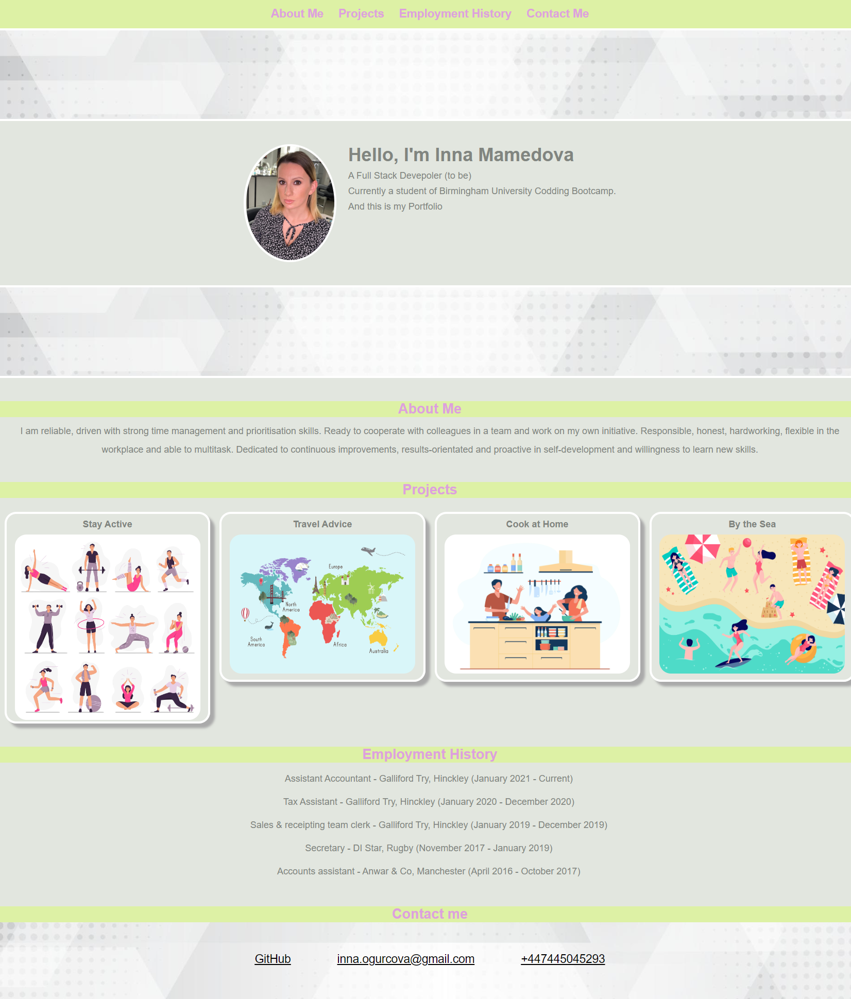

# Inna's Portfolio

Hi my name is Inna Mamedova, I am a student of Birmingham University Codding Bootcamp, by the end of this year will be able to qualify myself as Full Stack web developer.

# Project requirements
 Create your portfolio web page that contains a work samples and make it accessible for potential employers.

# Details

The web page has been created using HTML + CSS languages.
I have set the content of the web page using HTML, I have structured HTML file using appropriate elements for each block of information to make file easily looked through.
I have added links to other web pages and pictures stored in local files.
I have reached desirable design and layout of the web page using CSS. I have used a flex boxes to place HTML elements the way I wanted. I have choose colors and styles of the html elements using CSS properties. I have used media screen property to adjust styles for tablets and smartphones.

# Screenshot

# Link

[Web page](https://inna1201.github.io/Inna-s-Portfolio-Challenge-2-/)
